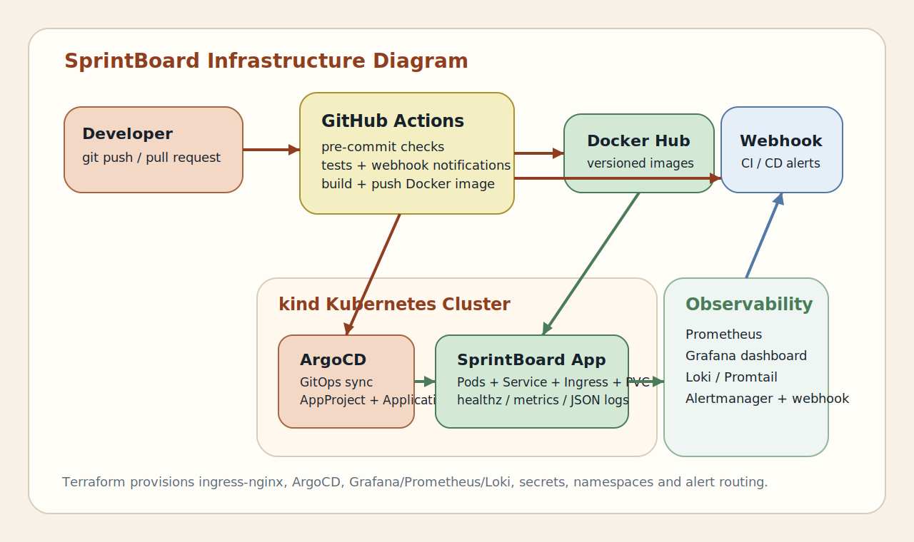

# SprintBoard

SprintBoard is a lightweight web-based task board that demonstrates a full DevOps delivery flow around a simple Python application. The project covers source control, pre-commit quality gates, CI, Docker image publishing, GitOps CD with ArgoCD, Kubernetes orchestration, observability with Prometheus/Loki/Grafana, alerting, Infrastructure as Code, and project documentation.

## Problem It Solves

The application itself manages tasks across `TODO`, `DOING`, and `DONE` columns. The bigger goal of the repository is to show how a small app can still be delivered with a production-style platform setup:

- safe commits with `pre-commit`
- automated testing and linting
- Docker build and push to Docker Hub
- GitOps deployment through ArgoCD
- Kubernetes workloads and pods managed through Helm
- metrics, logs, dashboards, and webhook alerts
- infrastructure bootstrapped through Terraform plus automated cluster setup

## Repository

The project is already a Git repository. To attach it to GitHub and push it:

```bash
git remote add origin https://github.com/<your-user>/<your-repo>.git
git add .
git commit -m "Initial DevOps delivery"
git push -u origin main
```

## Architecture Diagram



More details are described in [docs/architecture.md](docs/architecture.md).

## Application Endpoints

- `GET /` renders the task board
- `POST /tasks` creates a task
- `POST /tasks/<id>/advance` moves a task through the workflow
- `GET /healthz` exposes a health check
- `GET /metrics` exposes Prometheus metrics

## Local Run

### 1. Run with Python

Requirements:

- Python `3.12+`

Commands:

```bash
python -m unittest discover -s tests -v
python -m app.server
```

The app will be available at `http://localhost:8000`.

### 2. Run with Docker

```bash
docker build -t sprintboard:local .
docker run -p 8000:8000 -v ${PWD}/data:/data sprintboard:local
```

### 3. Run with Docker Compose

```bash
docker compose up --build
```

## Local Kubernetes Cluster

The repository includes a local Kubernetes bootstrap based on `kind`.

Requirements:

- `kind`
- `kubectl`
- `terraform`
- Docker Desktop or another local container runtime

Cluster definition:

- [infra/kind/kind-config.yaml](infra/kind/kind-config.yaml)

Bootstrap script:

- [scripts/bootstrap-cluster.ps1](scripts/bootstrap-cluster.ps1)

Example:

```powershell
.\scripts\bootstrap-cluster.ps1 `
  -GitOpsRepoUrl "https://github.com/<your-user>/<your-repo>.git" `
  -DockerHubUsername "<dockerhub-user>" `
  -DockerHubToken "<dockerhub-token>" `
  -NotificationWebhookUrl "https://hooks.example.com/devops" `
  -GrafanaAdminPassword "<strong-password>"
```

What this does:

1. creates a local `kind` cluster
2. installs `ingress-nginx`
3. applies Terraform in `infra/terraform`
4. installs ArgoCD, kube-prometheus-stack, Loki, and Promtail
5. creates the ArgoCD `Application` that deploys SprintBoard through Helm

After bootstrap:

- application URL: `http://sprintboard.127.0.0.1.nip.io`
- Grafana access: `kubectl -n monitoring get svc` and port-forward the Grafana service to `localhost:3000`
- ArgoCD access: `kubectl -n argocd get svc` and port-forward the ArgoCD server service to `localhost:8080`

Useful verification commands:

```bash
kubectl get pods -A
kubectl get ingress -A
kubectl get applications -n argocd
```

## Pre-Commit Hooks

Configuration:

- [.pre-commit-config.yaml](.pre-commit-config.yaml)

Installed checks:

- YAML and merge-conflict validation
- trailing whitespace and EOF normalization
- private-key detection
- `detect-secrets` with `.secrets.baseline`
- `ruff` lint and formatting
- Python unit tests before commit

Setup:

```bash
pip install -r requirements-dev.txt
pre-commit install
pre-commit run --all-files
```

## CI Pipeline

Workflow:

- [.github/workflows/ci.yml](.github/workflows/ci.yml)

The CI pipeline does the following:

1. runs `pre-commit`
2. runs unit tests
3. lints the Helm chart
4. validates Terraform formatting and configuration
5. builds and pushes a Docker image to Docker Hub on `main`
6. sends a webhook notification with job results

Required GitHub Secrets:

- `DOCKERHUB_USERNAME`
- `DOCKERHUB_TOKEN`
- `WEBHOOK_URL`

## CD Pipeline

Workflow:

- [.github/workflows/cd.yml](.github/workflows/cd.yml)

Chosen CD approach:

- `GitHub Actions` for image promotion
- `Helm` for application packaging
- `ArgoCD` for GitOps synchronization

Flow:

1. CI finishes successfully on `main`
2. CD updates `deploy/helm/sprintboard/values-prod.yaml` with the new image tag
3. the manifest change is committed back to the repo
4. ArgoCD detects the change and syncs the Kubernetes deployment
5. a deployment webhook notification is sent

The CI workflow ignores pure `values-prod.yaml` promotion commits, which prevents a GitOps promotion loop.

## Kubernetes and Pods

Kubernetes resources are packaged in:

- [deploy/helm/sprintboard](deploy/helm/sprintboard)

The chart creates:

- `Deployment`
- `Service`
- `Ingress`
- `PersistentVolumeClaim`
- `ConfigMap`
- `ServiceMonitor`
- `PrometheusRule`

The deployment runs multiple application pods through `replicaCount`, and the cluster also contains pods for:

- `ingress-nginx`
- `argocd`
- `kube-prometheus-stack`
- `grafana`
- `loki`
- `promtail`

## Observability and Alerting

Observability stack:

- Prometheus metrics from `/metrics`
- JSON application logs to stdout
- `ServiceMonitor` for scraping
- `PrometheusRule` alerts for errors and unavailable replicas
- Alertmanager webhook routing
- Loki + Promtail for log aggregation
- Grafana dashboard provisioning through Terraform

Grafana dashboard source:

- [infra/grafana/dashboards/sprintboard-overview.json](infra/grafana/dashboards/sprintboard-overview.json)

## Infrastructure as Code

Terraform lives in:

- [infra/terraform](infra/terraform)

Terraform provisions:

- namespaces: `argocd`, `monitoring`, `sprintboard`, `ingress-nginx`
- Docker Hub pull secret
- Grafana admin secret
- Alertmanager webhook secret
- `ingress-nginx`
- `argo-cd`
- `kube-prometheus-stack`
- `loki`
- `promtail`
- ArgoCD `AppProject`
- ArgoCD `Application`
- Grafana dashboard ConfigMap

Example setup:

```bash
cp infra/terraform/terraform.tfvars.example infra/terraform/terraform.tfvars
cd infra/terraform
terraform init
terraform plan
terraform apply
```

## Configuration and Secrets Management

Secrets are not stored in application code.

Secret handling in this project:

- GitHub Secrets for CI/CD credentials and webhook URLs
- Kubernetes Secrets created by Terraform
- ConfigMap for non-secret runtime configuration
- Docker registry pull secret for private image pulls
- `.gitignore` excludes local Terraform variable files
- `detect-secrets` prevents accidental secret commits

## Technologies and Versions

- Python `3.12+`
- SQLite `3`
- Docker `26+`
- Docker Compose `v2`
- Git `2.40+`
- pre-commit `4.2.0`
- detect-secrets `1.5.0`
- Ruff `0.11.7`
- Helm `3.15+`
- Terraform `1.8+`
- Kubernetes `1.29+`
- kind `0.23+`
- ArgoCD `2.x`
- Prometheus Operator / kube-prometheus-stack
- Loki / Promtail
- Grafana `10+`
- GitHub Actions

## Project Structure

```text
.
|-- app/                         # Python web application, HTML rendering, metrics, config, DB access
|-- tests/                       # Unit tests
|-- scripts/                     # Automation helpers, including cluster bootstrap and image-tag promotion
|-- .github/workflows/           # CI and CD GitHub Actions workflows
|-- deploy/argocd/               # Standalone ArgoCD manifests
|-- deploy/helm/sprintboard/     # Helm chart for the application
|-- docs/                        # Architecture notes and infrastructure diagram
|-- infra/grafana/dashboards/    # Grafana dashboard JSON provisioned by Terraform
|-- infra/kind/                  # Local Kubernetes cluster definition
|-- infra/terraform/             # Infrastructure as Code for cluster add-ons and GitOps resources
|-- Dockerfile                   # Container build definition
|-- docker-compose.yml           # Local container run
|-- .pre-commit-config.yaml      # Commit-time quality and secret scanning
`-- README.md                    # Project documentation
```

## Quick Verification

```bash
python -m unittest discover -s tests -v
```
